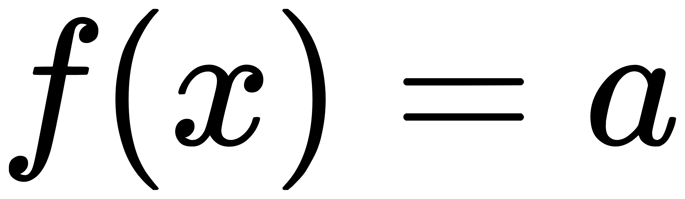

# 常见函数选讲

## By: Shane Xue

注：该篇是Shane Xue原创，是SMITS学会讲义体系的一部分。欢迎转载，但是麻烦标注出处：[shane-xue.github.io/maths/posts/frequently-used-functions](https://shane-xue.github.io/maths/posts/frequently-used-functions). 侵权必究.

### 目录

<a href = "#one"> 一、常函数 </a>

<a href = "#two"> 二、一次函数 </a>

<a href = "#three"> 三、二次函数 </a>

<a href = "#four"> 四、反比例函数 </a>

<a href = "#five"> 五、幂函数</a>

### 一、常函数

定义1.1 （常函数）

定义形如 的函数叫做常函数。

不难看出，常函数的图象就是一条平行于x轴的直线。

### 二、一次函数

### 三、二次函数

### 四、反比例函数

### 五、幂函数

©️Shane Xue, 2021. 保留所有权利.

鉴于作者本人水平有限，本作品难免有不正确之处。欢迎发送邮件到[qq2198631773@outlook.com](mailto:qq2198631773@outlook.com)指出错误。作者将及时更正错误，并在此处提名感谢您的贡献。如希望匿名，请备注。

作者不保证该作品的正确性，及时性和完整性。版权所有，侵权必究。
